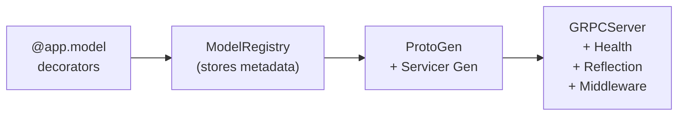

# Architecture

This page describes how BlazeRPC's internals fit together. Understanding the architecture is useful if you want to contribute, debug unexpected behavior, or extend the library with custom components.

## High-level overview

A BlazeRPC application moves through three phases: **registration**, **code generation**, and **serving**.



### 1. Registration

When you write `@app.model("sentiment")`, the decorator calls `ModelRegistry.register()`. The registry stores a `ModelInfo` dataclass for each model containing:

- The function reference.
- The model name and version.
- Input types and output type extracted from the function's type annotations via `extract_type_info()`.
- Whether the model is a streaming endpoint.

No protobuf code is generated at this stage. Registration is pure metadata collection.

### 2. Code generation

When the server starts (or when you run `blaze proto`), BlazeRPC generates two things from the registry:

**Proto schema.** `ProtoGenerator` walks the registry and produces a `.proto` file. Each model becomes a request message, a response message, and an RPC method on `InferenceService`. Python types are mapped to proto types via `PYTHON_TYPE_MAP` and `DTYPE_MAP`. Streaming models produce `returns (stream Response)` RPCs.

**Servicer.** `InferenceServicer` implements the `__mapping__()` protocol that grpclib expects. For each model, it creates a handler function that:

1. Receives the raw request from the gRPC stream.
2. Decodes it into keyword arguments.
3. Calls the model function (via `asyncio.to_thread()` if it is synchronous).
4. Encodes the result and sends it back.

Streaming models use async generators -- each `yield` sends one response message over the open stream.

### 3. Serving

`BlazeApp.serve()` assembles the full handler stack:

1. Builds an `InferenceServicer` from the registry.
2. Creates a `Health` service (gRPC health checking protocol).
3. Creates reflection handlers so tools like `grpcurl` can discover the API.
4. Passes all handlers to `GRPCServer`, which wraps `grpclib.server.Server`.

The server installs signal handlers for `SIGINT` and `SIGTERM` and blocks until one of them fires. On shutdown, it closes the listener and waits up to a configurable grace period for in-flight requests to complete.

## Module map

```bash
src/blazerpc/
├── __init__.py              # Public API exports
├── app.py                   # BlazeApp -- the entry point
├── types.py                 # TensorInput, TensorOutput, type introspection
├── exceptions.py            # Exception hierarchy
│
├── runtime/
│   ├── registry.py          # ModelRegistry, ModelInfo dataclass
│   ├── executor.py          # ModelExecutor (sync/async bridging)
│   ├── batcher.py           # Adaptive batching with partial failure handling
│   └── serialization.py     # Tensor and scalar serialization
│
├── codegen/
│   ├── proto.py             # .proto file generation
│   └── servicer.py          # Dynamic grpclib servicer generation
│
├── server/
│   ├── grpc.py              # GRPCServer with signal handling and graceful shutdown
│   ├── health.py            # gRPC health checking protocol
│   ├── reflection.py        # gRPC server reflection
│   └── middleware.py        # Logging, metrics, and extensible middleware base
│
├── contrib/
│   ├── pytorch.py           # PyTorch <-> NumPy helpers and @torch_model
│   ├── tensorflow.py        # TensorFlow <-> NumPy helpers and @tf_model
│   └── onnx.py              # ONNX Runtime session wrapper
│
└── cli/
    ├── main.py              # Typer CLI entry point (blaze serve, blaze proto)
    ├── serve.py             # App loading from import strings
    └── proto.py             # Proto file export logic
```

## Request lifecycle

Here is the full path of a unary (non-streaming) request:

1. **Client sends request** over gRPC to `blazerpc.InferenceService/PredictSentiment`.
2. **grpclib** matches the path to the handler registered in `InferenceServicer.__mapping__()`.
3. **Handler** calls `stream.recv_message()` to read the request bytes.
4. **Decode** -- `_decode_request()` converts the raw message into keyword arguments.
5. **Batching** (optional) -- If batching is enabled, the request is submitted to the `Batcher` queue. The batcher collects requests until `max_batch_size` is reached or `batch_timeout_ms` expires, then calls the model function with the full batch.
6. **Execution** -- The model function runs. If it is synchronous, it is offloaded to a thread pool with `asyncio.to_thread()` so it does not block the event loop.
7. **Encode** -- `_encode_response()` converts the result to its wire representation. NumPy arrays become `TensorProto` messages.
8. **Handler** calls `stream.send_message()` to send the response.

For streaming models, steps 6-8 repeat for each yielded value.

## Adaptive batching internals

The `Batcher` runs as a background `asyncio.Task`. Its loop:

1. Waits for the first item to arrive in the queue.
2. Collects additional items until either `max_batch_size` is reached or `batch_timeout_ms` elapses.
3. Calls the inference function with the collected batch.
4. Distributes results back to individual futures.

If the inference function raises an exception, every future in the batch receives that exception. If the function returns an `Exception` instance at a specific index, only that item's future is rejected -- other items in the batch still receive their results. This is the partial failure model.

## Type system

BlazeRPC's type system bridges Python annotations and protobuf fields:

| Python type                         | Proto type       | Notes                      |
| ----------------------------------- | ---------------- | -------------------------- |
| `str`                               | `string`         |                            |
| `int`                               | `int64`          |                            |
| `float`                             | `float`          |                            |
| `bool`                              | `bool`           |                            |
| `bytes`                             | `bytes`          |                            |
| `list[float]`                       | `repeated float` | Any `list[T]` is supported |
| `TensorInput[np.float32, 224, 224]` | `TensorProto`    | Shape and dtype metadata   |
| `TensorOutput[np.float32, 1000]`    | `TensorProto`    |                            |

`TensorInput` and `TensorOutput` are generic type annotations. At class-getitem time they produce a `_TensorType` instance that stores the dtype and shape. The codegen layer uses this metadata to emit `TensorProto` message fields and the serialization layer uses it to validate arrays at runtime.

## Middleware system

Middleware hooks into grpclib's event system rather than wrapping handlers. Each middleware subclass implements `on_request()` and `on_response()`, which are called via `RecvRequest` and `SendTrailingMetadata` events respectively.

This design means middleware runs outside the handler function. It cannot modify request data, but it can inspect metadata, record timing, and observe response status codes -- which is exactly what logging and metrics middleware need.

To write custom middleware, subclass `Middleware` and call `attach(server)` on the grpclib `Server` instance.
