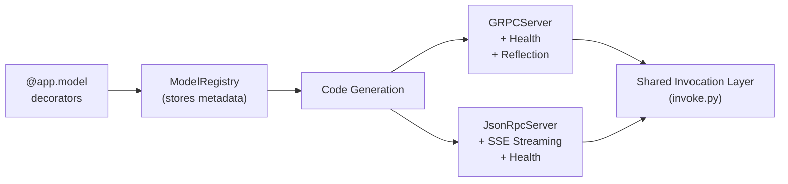

# Architecture

This page describes how BlazeRPC's internals fit together. Understanding the architecture is useful if you want to contribute, debug unexpected behavior, or extend the library with custom components.

## High-level overview

A BlazeRPC application moves through three phases: **registration**, **code generation**, and **serving**.


```mermaid
flowchart LR
    A["@app.model\ndecorators"] --> B["ModelRegistry\n(stores metadata)"]
    B --> C["Code Generation"]
    C --> D["GRPCServer\n+ Health\n+ Reflection"]
    C --> E["JsonRpcServer\n+ SSE Streaming\n+ Health"]
    D --> F["Shared Invocation Layer\n(invoke.py)"]
    E --> F
```

### 1. Registration

When you write `@app.model("sentiment")`, the decorator calls `ModelRegistry.register()`. The registry stores a `ModelInfo` dataclass for each model containing:

- The function reference.
- The model name and version.
- Input types and output type extracted from the function's type annotations via `extract_type_info()`.
- Whether the model is a streaming endpoint.

No protobuf code is generated at this stage. Registration is pure metadata collection.

### 2. Code generation

When the server starts (or when you run `blaze proto`), BlazeRPC generates two things from the registry:

**Proto schema.** `ProtoGenerator` walks the registry and produces a `.proto` file. Each model becomes a request message, a response message, and an RPC method on `InferenceService`. Python types are mapped to proto types via `PYTHON_TYPE_MAP` and `DTYPE_MAP`. Streaming models produce `returns (stream Response)` RPCs.

**Servicer.** `InferenceServicer` implements the `__mapping__()` protocol that grpclib expects. For each model, it creates a handler function that calls the shared invocation layer.

**JSON-RPC dispatcher.** `JsonRpcDispatcher` handles JSON-RPC 2.0 requests. It parses the JSON envelope, resolves the model from the method name (`predict.<model>`), and calls the same shared invocation layer.

Both transports delegate to `invoke_model()` and `invoke_streaming_model()` in `blazerpc.codegen.invoke`, which handle dependency resolution, sync/async bridging, and batcher integration.

Streaming models use async generators -- each `yield` sends one response message (a gRPC stream message or an SSE event).

### 3. Serving

BlazeRPC supports two transport modes:

**gRPC** (`app.serve()`): Builds an `InferenceServicer`, a `Health` service, and reflection handlers, then passes them to `GRPCServer` (wraps `grpclib.server.Server`).

**JSON-RPC** (`app.serve_jsonrpc()`): Builds a `JsonRpcDispatcher` and passes it to `JsonRpcServer` (wraps `aiohttp`). Exposes `POST /jsonrpc`, `POST /jsonrpc/stream/{model}` (SSE), and `GET /health`.

**Both** (`app.serve_both()`): Runs both servers concurrently with shared batchers via `asyncio.gather()`.

All servers install signal handlers for `SIGINT` and `SIGTERM` and block until one fires. On shutdown, they close listeners and wait up to a configurable grace period for in-flight requests to complete.

## Module map

```bash
src/blazerpc/
├── __init__.py              # Public API exports
├── app.py                   # BlazeApp -- the entry point
├── types.py                 # TensorInput, TensorOutput, type introspection
├── exceptions.py            # Exception hierarchy
│
├── runtime/
│   ├── registry.py          # ModelRegistry, ModelInfo dataclass
│   ├── executor.py          # ModelExecutor (sync/async bridging)
│   ├── batcher.py           # Adaptive batching with partial failure handling
│   ├── serialization.py     # Tensor and scalar serialization (Protobuf)
│   └── json_serialization.py # Tensor serialization for JSON transport
│
├── codegen/
│   ├── proto.py             # .proto file generation
│   ├── servicer.py          # Dynamic grpclib servicer generation
│   ├── invoke.py            # Shared invocation logic (both transports)
│   └── jsonrpc_handler.py   # JSON-RPC 2.0 dispatcher
│
├── server/
│   ├── grpc.py              # GRPCServer with signal handling and graceful shutdown
│   ├── jsonrpc.py           # JsonRpcServer (aiohttp) for JSON-RPC 2.0
│   ├── health.py            # gRPC health checking protocol
│   ├── reflection.py        # gRPC server reflection
│   └── middleware.py        # gRPC + transport-agnostic middleware
│
├── contrib/
│   ├── pytorch.py           # PyTorch <-> NumPy helpers and @torch_model
│   ├── tensorflow.py        # TensorFlow <-> NumPy helpers and @tf_model
│   └── onnx.py              # ONNX Runtime session wrapper
│
└── cli/
    ├── main.py              # Typer CLI entry point (blaze serve, blaze proto)
    ├── serve.py             # App loading from import strings
    └── proto.py             # Proto file export logic
```

## Request lifecycle

### gRPC path

1. **Client sends request** over gRPC to `blazerpc.InferenceService/PredictSentiment`.
2. **grpclib** matches the path to the handler registered in `InferenceServicer.__mapping__()`.
3. **Handler** calls `stream.recv_message()` to read the request bytes.
4. **Decode** -- `_decode_request()` converts the raw message into keyword arguments.
5. **Dependency resolution** -- `resolve_deps()` builds `Context` from the gRPC stream and resolves any `Depends` parameters.
6. **Batching** (optional) -- If batching is enabled, the request is submitted to the `Batcher` queue.
7. **Execution** -- `invoke_model()` runs the model function. Sync functions are offloaded via `asyncio.to_thread()`.
8. **Encode** -- `_encode_response()` converts the result to Protobuf.
9. **Handler** calls `stream.send_message()` to send the response.

### JSON-RPC path

1. **Client sends HTTP POST** to `/jsonrpc` with a JSON-RPC 2.0 envelope.
2. **JsonRpcServer** parses the JSON body and delegates to `JsonRpcDispatcher.handle()`.
3. **Dispatcher** resolves the model from the method name (`predict.<model>`).
4. **JSON conversion** -- `json_to_python()` converts params using type annotations (including base64 tensor dicts).
5. **Dependency resolution** -- `resolve_deps()` builds `Context` from HTTP headers and peer info.
6. **Batching** (optional) -- Same batcher as gRPC.
7. **Execution** -- `invoke_model()` runs the model function.
8. **JSON conversion** -- `python_to_json()` converts the result (including tensor arrays to base64 dicts).
9. **Response** -- JSON-RPC 2.0 response envelope is sent as HTTP JSON.

For streaming models, the gRPC path sends stream messages, while JSON-RPC sends Server-Sent Events (SSE).

## Adaptive batching internals

The `Batcher` runs as a background `asyncio.Task`. Its loop:

1. Waits for the first item to arrive in the queue.
2. Collects additional items until either `max_batch_size` is reached or `batch_timeout_ms` elapses.
3. Calls the inference function with the collected batch.
4. Distributes results back to individual futures.

If the inference function raises an exception, every future in the batch receives that exception. If the function returns an `Exception` instance at a specific index, only that item's future is rejected -- other items in the batch still receive their results. This is the partial failure model.

## Type system

BlazeRPC's type system bridges Python annotations and protobuf fields:

| Python type                                                        | Proto type       | Notes                      |
| ------------------------------------------------------------------ | ---------------- | -------------------------- |
| `str`                                                              | `string`         |                            |
| `int`                                                              | `int64`          |                            |
| `float`                                                            | `float`          |                            |
| `bool`                                                             | `bool`           |                            |
| `bytes`                                                            | `bytes`          |                            |
| `list[float]`                                                      | `repeated float` | Any `list[T]` is supported |
| `TensorInput[np.float32, tuple[Literal[224], Literal[224]]]`       | `TensorProto`    | Shape and dtype metadata   |
| `TensorOutput[np.float32, tuple[Literal[1000]]]`                   | `TensorProto`    |                            |

`TensorInput` and `TensorOutput` are generic type annotations; `Literal` comes
from `typing`. At class-getitem time they produce a `_TensorType` instance that
stores the dtype and shape. The codegen layer uses this metadata to emit
`TensorProto` message fields and the serialization layer uses it to validate
arrays at runtime.

## Middleware system

BlazeRPC has two middleware layers:

**gRPC middleware** (`Middleware`) hooks into grpclib's event system via `RecvRequest` and `SendTrailingMetadata` events. It runs outside the handler and can inspect metadata, record timing, and observe status codes.

**Transport-agnostic middleware** (`TransportMiddleware`) works with both JSON-RPC and any future transports. It receives `RequestInfo` and `ResponseInfo` objects with transport-neutral fields (method, peer, headers, duration, status). Use this when writing middleware that should work across all transports.

See the [middleware guide](guides/middleware.md) for usage details.
