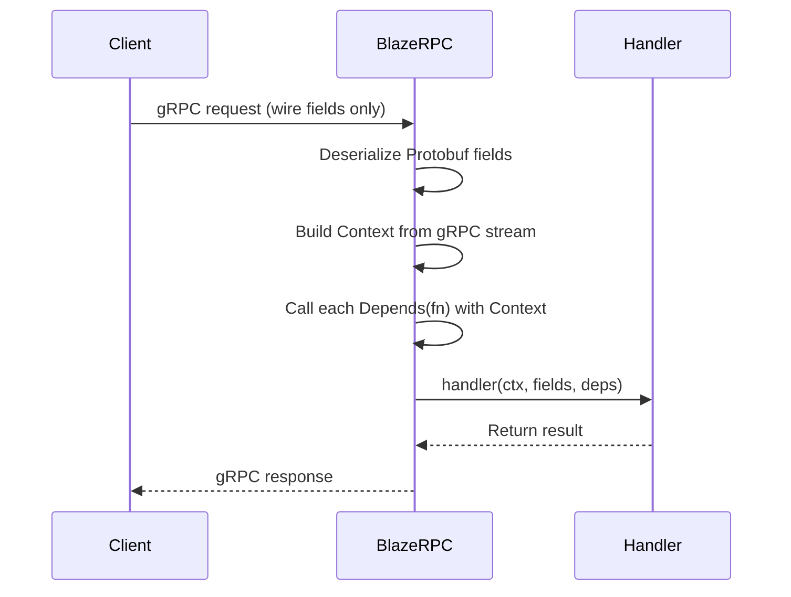

# Dependency Injection

Your model handler needs a loaded classifier, a database connection pool, or an auth token from gRPC headers. You could hard-wire these as module-level globals, but that makes testing painful, swapping resources impossible, and request metadata invisible. BlazeRPC's dependency injection system solves this with three simple building blocks.

!!! info "What you'll learn"
    By the end of this guide you will understand:

    - **`app.state`** — how to share resources across your application
    - **`Context`** — how to access per-request gRPC metadata
    - **`Depends(fn)`** — how to write reusable, testable dependency functions

    You will build up to a working **auth-protected endpoint** that extracts a token from gRPC headers.

## The problem

Consider a simple model handler that uses a module-level global:

```python
from blazerpc import BlazeApp

app = BlazeApp()

# A module-level global — works, but creates problems.
clf = train_classifier()

@app.model("predict")
def predict(features: list[float]) -> int:
    return int(clf.predict([features])[0])
```

This is fine for a quick prototype. But what happens when you need to:

- **Swap the classifier** at runtime without restarting the server?
- **Test the handler** in isolation without training a real model?
- **Read gRPC headers** like an authorization token or client ID?

You cannot do any of these cleanly with a hard-coded global. BlazeRPC gives you three tools to solve this, each building on the last.

## `app.state` — shared application state

The simplest improvement is moving shared resources onto `app.state`. This is a namespace that lives for the lifetime of the application:

```python
from blazerpc import BlazeApp

app = BlazeApp()

# Attach resources at startup.
app.state.classifier = train_classifier()
app.state.class_names = ["setosa", "versicolor", "virginica"]

@app.model("predict")
def predict(features: list[float]) -> int:
    return int(app.state.classifier.predict([features])[0])
```

Now the classifier is no longer a free-floating global — it belongs to the application. You can replace `app.state.classifier` at any time, and every handler sees the new value.

!!! tip
    `app.state` is a plain `types.SimpleNamespace`. You can attach any attribute to it, and type checkers will accept arbitrary names.

This solves the "swap at runtime" problem. But the handler still cannot see request-level information like gRPC headers or the caller's address. For that, you need `Context`.

## `Context` — per-request information

While `app.state` gives you application-level data, `Context` gives you **request-level** data: who is calling, what method they called, and what headers they sent.

Add a `Context`-typed parameter to any handler to receive it automatically:

```python
from blazerpc import BlazeApp, Context

app = BlazeApp()

@app.model("info")
def info(ctx: Context, text: str) -> str:
    return f"Called {ctx.method} from {ctx.peer}"
```

BlazeRPC sees the `Context` type annotation, builds a context object from the live gRPC stream, and passes it to your handler. You do not need to create it yourself.

### Context attributes

| Attribute   | Type                | Description                                                             |
| ----------- | ------------------- | ----------------------------------------------------------------------- |
| `metadata`  | `MultiDict \| None` | gRPC invocation metadata (headers) sent by the client.                  |
| `peer`      | `Any`               | Connection peer info (address, certificate).                            |
| `method`    | `str`               | Full gRPC method path, e.g. `"/blazerpc.InferenceService/PredictIris"`. |
| `app_state` | `AppState`          | Reference to `app.state`.                                               |

Notice that `ctx.app_state` is the **same object** as `app.state`. This means you can reach your shared resources from inside any handler or dependency function through the context.

!!! info "Context parameters are invisible to clients"
    `Context` is **not** included in the generated Protobuf message. Clients never send it — the framework injects it at request time. Only regular parameters like `text: str` become wire-level fields.

## `Depends()` — reusable dependencies

A dependency is just a function that receives `Context` and returns a value. There is no special base class or interface to implement.

Here is the simplest possible dependency — it pulls a classifier from application state:

```python
from blazerpc import Context

def get_classifier(ctx: Context):
    return ctx.app_state.classifier
```

To inject it into a handler, use `Depends()` as the parameter's default value:

```python
from blazerpc import BlazeApp, Context, Depends
from sklearn.linear_model import LogisticRegression

app = BlazeApp()
app.state.classifier = train_model()

def get_classifier(ctx: Context) -> LogisticRegression:
    return ctx.app_state.classifier

@app.model("predict")
def predict(
    features: list[float],
    clf: LogisticRegression = Depends(get_classifier),
) -> list[float]:
    return clf.predict_proba([features])[0].tolist()
```

This might look like extra ceremony compared to accessing `app.state` directly in the handler body. The benefit becomes clear when you have **multiple handlers** that all need the same resource:

- Write the extraction logic **once** in a dependency function.
- **Reuse** it across as many handlers as you need.
- **Test** handlers by swapping the dependency function, without touching application state.

!!! tip "It's just a function"
    Any callable that accepts `Context` and returns a value works as a dependency. No magic, no registration — just a function.

## How injection works at runtime

When a request arrives, BlazeRPC performs these steps before your handler runs:



In detail:

1. The client sends a gRPC request containing only the **wire fields** (regular parameters like `text`, `features`).
2. BlazeRPC deserializes the Protobuf message into keyword arguments.
3. The framework builds a `Context` object from the live gRPC stream (metadata, peer, method path, app state).
4. Each `Depends(fn)` function is called with the `Context`. If the function is `async`, it is awaited.
5. The handler is called with all three kinds of arguments merged together: context, request fields, and resolved dependencies.
6. The handler's return value is serialized and sent back to the client.

## Combining multiple dependencies

A handler can use `Context`, multiple `Depends` parameters, and request fields together:

```python
from blazerpc import BlazeApp, Context, Depends

app = BlazeApp()
app.state.classifier = train_model()
app.state.class_names = ["setosa", "versicolor", "virginica"]

def get_model(ctx: Context):
    return ctx.app_state.classifier

def get_class_names(ctx: Context) -> list[str]:
    return ctx.app_state.class_names

@app.model("label")
def label(
    ctx: Context,
    features: list[float],
    model = Depends(get_model),
    names: list[str] = Depends(get_class_names),
) -> str:
    idx = int(model.predict([features])[0])
    return f"{names[idx]} (via {ctx.method})"
```

!!! note "Parameter ordering convention"
    We recommend placing parameters in this order:

    1. **`Context`** — framework-injected request context
    2. **Request fields** — the Protobuf inputs sent by clients
    3. **`Depends(...)`** — injected dependencies

    `Depends` parameters must come last because they have default values, and Python requires parameters with defaults to follow those without.

## Async dependencies

Dependency functions can be `async`. BlazeRPC detects coroutine functions and awaits them automatically:

```python
async def get_db_connection(ctx: Context):
    return await ctx.app_state.db_pool.acquire()

@app.model("lookup")
async def lookup(
    user_id: int,
    db = Depends(get_db_connection),
) -> str:
    row = await db.fetchone("SELECT name FROM users WHERE id = ?", user_id)
    return row["name"]
```

## Real-world pattern — authentication

Now let's put it all together with a practical use case: extracting an auth token from gRPC metadata.

Without dependency injection, the handler has to do everything inline:

```python
@app.model("secure")
def secure_predict(ctx: Context, text: str) -> str:
    # Manual metadata extraction — messy, not reusable.
    if not ctx.metadata:
        raise ValidationError("missing metadata")
    token = dict(ctx.metadata).get("authorization")
    if not token:
        raise ValidationError("missing authorization header")
    return f"Authenticated as {token}: {text}"
```

With `Depends`, you extract the auth logic into a reusable function:

```python
from blazerpc import BlazeApp, Context, Depends
from blazerpc.exceptions import ValidationError

app = BlazeApp()

def require_auth(ctx: Context) -> str:
    """Extract and validate the auth token, or raise."""
    if not ctx.metadata:
        raise ValidationError("missing metadata")
    token = dict(ctx.metadata).get("authorization")
    if not token:
        raise ValidationError("missing authorization header")
    return token

@app.model("secure")
def secure_predict(
    text: str,
    token: str = Depends(require_auth),
) -> str:
    return f"Authenticated as {token}: {text}"
```

The handler is now clean and focused on its job. The auth logic lives in one place and can be reused across every handler that needs it.

!!! warning
    If a dependency function raises an exception, the handler is **never called**. The exception propagates as a gRPC error to the client. This is intentional for auth guards — a failed check should abort the request immediately.

## When to use what

| Tool | Use when | Example |
| --- | --- | --- |
| **`app.state`** | You have a resource created once at startup and shared across all requests. | Loaded ML models, config objects, connection pools. |
| **`Context`** | You need per-request information that is not part of the request payload. | Client IP, gRPC method path, invocation headers. |
| **`Depends(fn)`** | You have reusable logic that multiple handlers share, especially logic that involves `Context`. | Auth checks, resource lookup, metadata parsing. |

!!! tip
    Start simple. Access `app.state` directly in the handler body. Extract a `Depends` function only when you find yourself repeating the same logic across multiple handlers.

## Limitations and workarounds

### Batching is disabled for DI models

Models that use `Context` or `Depends` are automatically excluded from the adaptive batcher, even when `enable_batching=True`. A log warning is emitted at startup for each excluded model.

**Why?** Each request needs its own `Context` object (with its own metadata, peer info, and method path). Grouping multiple requests into a single batch call would require picking one `Context` and discarding the rest, which would break auth checks and any logic that reads per-request headers.

**Workaround:** If you need both batching and shared resources, access them via `app.state` directly in the handler body instead of through `Depends`:

```python
@app.model("fast_predict")
def fast_predict(features: list[float]) -> int:
    # Direct access — compatible with batching.
    return int(app.state.classifier.predict([features])[0])
```

See [Adaptive batching — Automatic exclusions](batching.md#automatic-exclusions) for more details.

!!! warning
    There is no way to enable batching for a handler that uses `Context` or `Depends`. This is a deliberate design choice to prevent silent data loss.

### No nested dependencies

`Depends` functions receive `Context` only — they cannot declare their own `Depends` parameters. If you need to compose dependency logic, call one function from another:

```python
def get_db(ctx: Context):
    return ctx.app_state.db_pool

def get_user(ctx: Context):
    db = get_db(ctx)  # Call directly, not via Depends.
    return db.get_current_user(ctx.metadata)
```

!!! note
    This keeps the dependency resolution simple and predictable — there is no hidden resolution graph or circular-dependency risk.

## Full example

See the complete working example in [`examples/dependency_injection/`](https://github.com/blazerpc/blazerpc/tree/main/examples/dependency_injection):

- **`app.py`** — Server with `app.state`, `Context`, and `Depends`
- **`client.py`** — Client that calls the DI-powered handlers

### Next steps

- [Streaming](streaming.md) — send responses incrementally over gRPC streams
- [Adaptive batching](batching.md) — automatically group requests for throughput
- [Middleware](middleware.md) — add logging, metrics, and custom request hooks
